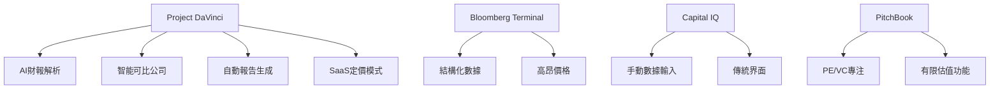
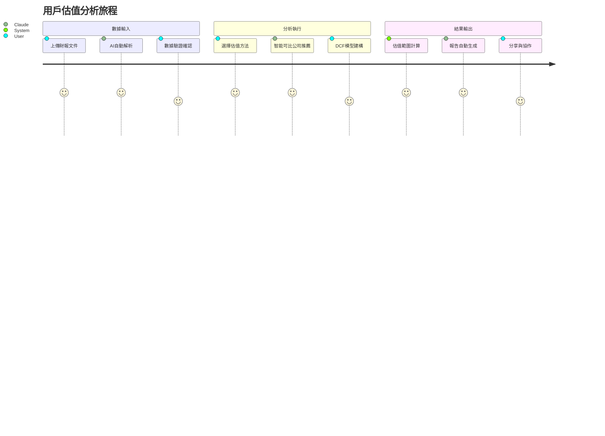
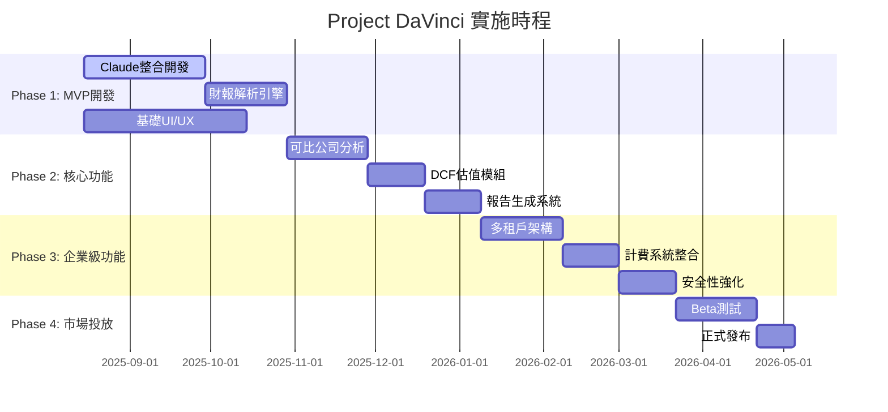

# Project DaVinci - AI自動化企業估值SaaS平台
## 專案啟動文檔 (Project Initiation Document)

**專案代號**: Project DaVinci  
**專案名稱**: AI-Powered Enterprise Valuation SaaS Platform  
**文檔版本**: v1.0  
**創建日期**: 2025年8月  
**專案經理**: [待指定]  
**技術負責人**: [待指定]  

---

## 1. 專案概述與願景

### 1.1 專案使命聲明
打造全球首個基於Claude AI技術的智能化企業估值SaaS平台，透過先進的NLP和機器學習技術，將複雜的財務估值流程自動化，為投資銀行、私募股權、創投基金及財務顧問提供專業級的估值分析工具。

### 1.2 核心價值主張
- **AI驅動的財報解析**: 使用Claude的強大文本理解能力，自動解析任何格式的財務報表
- **智能可比公司分析**: 基於語義相似度和業務邏輯的智能配對系統  
- **專業級估值報告**: 自動生成符合投行標準的估值分析報告
- **極致用戶體驗**: 將複雜估值流程簡化為4步驟操作

### 1.3 市場機會
- **市場規模**: 全球企業估值軟體市場預計2025年達到$12.5B，年複合增長率15.3%
- **目標客群**: 投行分析師、PE/VC投資經理、M&A部門、會計師事務所
- **差異化優勢**: 業界首個能處理非結構化財報的AI估值平台

---

## 2. IMPACT框架需求分析

### 2.1 Intelligence - 智能化需求

#### 2.1.1 核心AI能力架構

```python
# Claude Financial Analysis Engine 核心架構
class ClaudeFinancialEngine:
    def __init__(self):
        self.claude_client = anthropic.Anthropic(api_key=os.environ["CLAUDE_API_KEY"])
        self.knowledge_graph = FinancialKnowledgeGraph()
        self.validation_engine = CrossStatementValidator()
    
    async def parse_financial_statement(self, document: bytes) -> FinancialData:
        """使用Claude解析財務報表"""
        
        # 1. 文檔預處理與OCR (如需要)
        text_content = await self.extract_text(document)
        
        # 2. Claude分析財報結構
        structure_prompt = f"""
        作為專業的財務分析師，請分析以下財務報表，提取關鍵財務數據：
        
        {text_content}
        
        請以JSON格式返回標準化的財務數據，包含：
        - 資產負債表項目（現金、應收帳款、總資產、總負債、股東權益等）
        - 損益表項目（營收、營業費用、淨利潤等）
        - 現金流量表項目（營運現金流、投資現金流、籌資現金流）
        
        對於每個項目，請提供：
        - 標準化名稱
        - 數值（去除貨幣符號）
        - 期間（年份/季度）
        - 置信度評分
        """
        
        response = await self.claude_client.messages.create(
            model="claude-sonnet-4-20250514",
            max_tokens=4000,
            temperature=0.1,  # 低溫度確保數值準確性
            messages=[{"role": "user", "content": structure_prompt}]
        )
        
        # 3. 解析Claude回應並驗證
        financial_data = self.parse_claude_response(response.content)
        validation_result = await self.validation_engine.validate(financial_data)
        
        return FinancialData(
            data=financial_data,
            validation_score=validation_result.score,
            validation_issues=validation_result.issues
        )
```

#### 2.1.2 智能可比公司分析引擎

```python
class ComparableCompanyEngine:
    def __init__(self):
        self.claude_client = anthropic.Anthropic()
        self.vector_db = PineconeClient()  # 向量數據庫存儲公司描述
        
    async def find_comparable_companies(self, target_company: CompanyProfile) -> List[ComparableMatch]:
        """使用Claude進行智能可比公司分析"""
        
        # 1. 分析目標公司業務特徵
        analysis_prompt = f"""
        作為投資銀行的權益研究分析師，請分析以下公司的業務特徵：
        
        公司名稱：{target_company.name}
        行業分類：{target_company.industry}
        業務描述：{target_company.description}
        財務概況：{target_company.financial_summary}
        
        請提供：
        1. 核心業務關鍵詞（5-10個）
        2. 商業模式分類（B2B/B2C/Marketplace等）
        3. 收入模式（訂閱制/一次性/佣金制等）
        4. 成長階段（早期/成長期/成熟期）
        5. 地理覆蓋範圍
        6. 關鍵成功因子
        """
        
        business_analysis = await self.claude_client.messages.create(
            model="claude-sonnet-4-20250514",
            max_tokens=2000,
            messages=[{"role": "user", "content": analysis_prompt}]
        )
        
        # 2. 基於分析結果搜索可比公司
        search_criteria = self.extract_search_criteria(business_analysis.content)
        candidate_companies = await self.vector_db.similarity_search(
            query_vector=search_criteria.embedding,
            top_k=50
        )
        
        # 3. Claude評估可比性
        evaluation_prompt = f"""
        請評估以下候選公司與目標公司的可比性，並給出1-10分的評分：
        
        目標公司：{target_company.summary}
        
        候選公司：
        {self.format_candidate_list(candidate_companies)}
        
        評估標準：
        1. 業務模式相似度 (30%)
        2. 規模相似度 (25%)
        3. 地理市場重疊 (20%)
        4. 財務指標可比性 (25%)
        
        請返回JSON格式的評分結果。
        """
        
        evaluation = await self.claude_client.messages.create(
            model="claude-sonnet-4-20250514",
            max_tokens=3000,
            messages=[{"role": "user", "content": evaluation_prompt}]
        )
        
        return self.parse_comparable_results(evaluation.content)
```

### 2.2 Market - 市場定位分析

#### 2.2.1 目標客群細分

| 客群類別 | 規模 | 痛點 | 價值主張 | 定價策略 |
|---------|------|------|----------|----------|
| 投行分析師 | ~50K全球 | 手動財報輸入耗時 | 效率提升10x | Professional $99/月 |
| PE/VC投資經理 | ~30K全球 | 缺乏標準化估值流程 | 專業報告生成 | Enterprise $499/月 |
| 會計師事務所 | ~200K全球 | 客戶估值需求增加 | 服務能力擴展 | Enterprise+ 客製定價 |
| 財務顧問 | ~500K全球 | 估值專業度不足 | 專業工具賦能 | Professional $99/月 |

#### 2.2.2 競爭分析矩陣



### 2.3 Product - 產品功能架構

#### 2.3.1 核心用戶旅程



#### 2.3.2 功能模組詳細設計

```yaml
# 產品功能架構 (YAML)
product_modules:
  data_hub:
    components:
      - file_upload_interface
      - ai_parsing_engine
      - data_validation_ui
      - financial_data_viewer
    claude_integration:
      - document_analysis
      - data_extraction
      - quality_validation
      
  valuation_workshop:
    methodologies:
      - comparable_company_analysis
      - precedent_transaction_analysis
      - discounted_cash_flow
      - sum_of_parts
    claude_features:
      - intelligent_comp_selection
      - assumption_recommendation
      - sensitivity_analysis
      
  report_center:
    outputs:
      - football_field_chart
      - executive_summary
      - detailed_analysis_report
      - presentation_slides
    claude_capabilities:
      - narrative_generation
      - insight_synthesis
      - professional_writing
```

---

## 3. 三層架構設計 (3A架構)

### 3.1 Layer 1: AI Intelligence Layer

```python
# Claude Integration Service
class ClaudeIntegrationService:
    def __init__(self):
        self.client = anthropic.Anthropic()
        self.model = "claude-sonnet-4-20250514"
    
    async def analyze_document(self, document_content: str, analysis_type: str) -> AnalysisResult:
        """通用文檔分析接口"""
        prompts = {
            "financial_parsing": self.get_financial_parsing_prompt(document_content),
            "company_analysis": self.get_company_analysis_prompt(document_content),
            "valuation_narrative": self.get_valuation_narrative_prompt(document_content)
        }
        
        response = await self.client.messages.create(
            model=self.model,
            max_tokens=4000,
            temperature=0.1,
            messages=[{"role": "user", "content": prompts[analysis_type]}]
        )
        
        return AnalysisResult(
            content=response.content,
            tokens_used=response.usage.output_tokens,
            processing_time=response.processing_time
        )
    
    def get_financial_parsing_prompt(self, content: str) -> str:
        return f"""
        作為專業的財務分析師，請從以下文檔中提取關鍵財務數據：
        
        {content}
        
        請提取並標準化以下項目：
        1. 資產負債表：總資產、總負債、股東權益、現金及約當現金
        2. 損益表：營業收入、營業成本、營業費用、稅前淨利、稅後淨利
        3. 現金流量表：營業活動現金流、投資活動現金流、籌資活動現金流
        
        輸出格式：結構化JSON，包含數值、單位、期間
        """
```

### 3.2 Layer 2: Application Layer

#### 3.2.1 微服務架構設計

```docker
# docker-compose.yml - 微服務編排
version: '3.8'
services:
  api-gateway:
    image: davinci/api-gateway:latest
    ports:
      - "8000:8000"
    environment:
      - CLAUDE_API_KEY=${CLAUDE_API_KEY}
    depends_on:
      - user-service
      - valuation-service
      - claude-service
      
  claude-service:
    image: davinci/claude-service:latest
    environment:
      - CLAUDE_API_KEY=${CLAUDE_API_KEY}
      - CLAUDE_MODEL=claude-sonnet-4-20250514
    deploy:
      replicas: 3
      
  valuation-service:
    image: davinci/valuation-service:latest
    depends_on:
      - postgres
      - redis
      
  user-service:
    image: davinci/user-service:latest
    environment:
      - JWT_SECRET=${JWT_SECRET}
      - STRIPE_API_KEY=${STRIPE_API_KEY}
      
  postgres:
    image: timescale/timescaledb:latest
    environment:
      - POSTGRES_DB=davinci
      - POSTGRES_USER=${DB_USER}
      - POSTGRES_PASSWORD=${DB_PASSWORD}
    volumes:
      - postgres_data:/var/lib/postgresql/data
      
  redis:
    image: redis:alpine
    command: redis-server --appendonly yes
    
volumes:
  postgres_data:
```

#### 3.2.2 GraphQL API 設計

```graphql
# schema.graphql - GraphQL API 定義
type Query {
  getValuationProject(id: ID!): ValuationProject
  getComparableCompanies(criteria: CompSearchCriteria!): [ComparableCompany!]!
  generateValuationReport(projectId: ID!): ValuationReport
}

type Mutation {
  createValuationProject(input: CreateProjectInput!): ValuationProject!
  uploadFinancialDocument(projectId: ID!, file: Upload!): UploadResult!
  updateValuationAssumptions(projectId: ID!, assumptions: AssumptionsInput!): ValuationProject!
}

type ValuationProject {
  id: ID!
  name: String!
  targetCompany: Company!
  financialData: FinancialData
  comparableCompanies: [ComparableCompany!]
  valuationMethods: [ValuationMethod!]
  results: ValuationResults
  status: ProjectStatus!
  createdAt: DateTime!
  updatedAt: DateTime!
}

type FinancialData {
  balanceSheet: BalanceSheet
  incomeStatement: IncomeStatement
  cashFlowStatement: CashFlowStatement
  validationScore: Float
  validationIssues: [ValidationIssue!]
}

type ValuationResults {
  dcfValuation: DCFResult
  comparableMultiples: ComparableResult
  precedentTransactions: PrecedentResult
  footballFieldChart: FootballFieldData
  summaryRecommendation: String
}
```

### 3.3 Layer 3: Infrastructure Layer

#### 3.3.1 Kubernetes部署配置

```yaml
# k8s-deployment.yaml
apiVersion: apps/v1
kind: Deployment
metadata:
  name: claude-service
spec:
  replicas: 5
  selector:
    matchLabels:
      app: claude-service
  template:
    metadata:
      labels:
        app: claude-service
    spec:
      containers:
      - name: claude-service
        image: davinci/claude-service:v1.0
        ports:
        - containerPort: 8080
        env:
        - name: CLAUDE_API_KEY
          valueFrom:
            secretKeyRef:
              name: claude-secrets
              key: api-key
        resources:
          requests:
            memory: "512Mi"
            cpu: "500m"
          limits:
            memory: "1Gi"
            cpu: "1000m"
        livenessProbe:
          httpGet:
            path: /health
            port: 8080
          initialDelaySeconds: 30
          periodSeconds: 10
        readinessProbe:
          httpGet:
            path: /ready
            port: 8080
          initialDelaySeconds: 5
          periodSeconds: 5
---
apiVersion: v1
kind: Service
metadata:
  name: claude-service
spec:
  selector:
    app: claude-service
  ports:
  - port: 80
    targetPort: 8080
  type: ClusterIP
```

---

## 4. SaaS營運策略

### 4.1 多租戶架構實現

```sql
-- 多租戶數據庫架構
-- 方案：行級別安全性 (Row Level Security)

-- 建立租戶資料表
CREATE TABLE tenants (
    id UUID PRIMARY KEY DEFAULT gen_random_uuid(),
    name VARCHAR(255) NOT NULL,
    plan_type VARCHAR(50) NOT NULL,
    created_at TIMESTAMP DEFAULT CURRENT_TIMESTAMP,
    settings JSONB
);

-- 財務數據表（啟用RLS）
CREATE TABLE financial_data (
    id UUID PRIMARY KEY DEFAULT gen_random_uuid(),
    tenant_id UUID REFERENCES tenants(id),
    project_id UUID NOT NULL,
    statement_type VARCHAR(50) NOT NULL,
    line_item VARCHAR(255) NOT NULL,
    value DECIMAL(15,2),
    period DATE,
    currency VARCHAR(3),
    created_at TIMESTAMP DEFAULT CURRENT_TIMESTAMP
);

-- 啟用行級別安全性
ALTER TABLE financial_data ENABLE ROW LEVEL SECURITY;

-- 建立租戶隔離策略
CREATE POLICY tenant_isolation ON financial_data
    FOR ALL
    USING (tenant_id = current_setting('app.tenant_id', true)::UUID);

-- 應用程式層面設定租戶上下文
-- SET app.tenant_id = 'user-specific-tenant-uuid';
```

### 4.2 計費系統整合

```python
# Stripe整合服務
class BillingService:
    def __init__(self):
        stripe.api_key = settings.STRIPE_SECRET_KEY
        self.claude_usage_tracker = ClaudeUsageTracker()
    
    async def handle_subscription_webhook(self, event: stripe.Event):
        """處理Stripe訂閱事件"""
        if event['type'] == 'customer.subscription.created':
            await self.activate_subscription(event['data']['object'])
        elif event['type'] == 'customer.subscription.deleted':
            await self.deactivate_subscription(event['data']['object'])
        elif event['type'] == 'invoice.payment_succeeded':
            await self.record_payment(event['data']['object'])
    
    async def calculate_claude_usage_costs(self, tenant_id: str, period: DateRange) -> UsageCost:
        """計算Claude API使用費用"""
        usage_stats = await self.claude_usage_tracker.get_usage(tenant_id, period)
        
        # 基於tokens計算費用
        input_tokens_cost = usage_stats.input_tokens * 0.000003  # $0.000003 per input token
        output_tokens_cost = usage_stats.output_tokens * 0.000015  # $0.000015 per output token
        
        return UsageCost(
            input_tokens=usage_stats.input_tokens,
            output_tokens=usage_stats.output_tokens,
            total_cost=input_tokens_cost + output_tokens_cost,
            breakdown={
                'financial_parsing': usage_stats.parsing_tokens_cost,
                'company_analysis': usage_stats.analysis_tokens_cost,
                'report_generation': usage_stats.generation_tokens_cost
            }
        )
```

---

## 5. 關鍵營運指標 (KPIs)

### 5.1 North Star Metrics

```python
# 營運儀表板指標定義
class MetricsCollector:
    def __init__(self):
        self.analytics = MixpanelAnalytics()
        self.db = DatabaseConnection()
    
    async def collect_north_star_metrics(self) -> NorthStarMetrics:
        """收集北極星指標"""
        
        # 主要指標：成功生成的估值報告數量
        successful_reports = await self.db.query("""
            SELECT COUNT(*) as count
            FROM valuation_projects
            WHERE status = 'completed' 
            AND created_at >= CURRENT_DATE - INTERVAL '30 days'
        """)
        
        # 支撐指標
        metrics = NorthStarMetrics(
            successful_reports_30d=successful_reports[0]['count'],
            average_report_quality_score=await self.get_avg_quality_score(),
            user_satisfaction_nps=await self.get_nps_score(),
            claude_api_success_rate=await self.get_claude_success_rate()
        )
        
        return metrics
    
    async def track_aarrr_funnel(self) -> AARRRMetrics:
        """追蹤AARRR漏斗指標"""
        return AARRRMetrics(
            acquisition=await self.get_new_signups(),
            activation=await self.get_first_report_completion_rate(),
            retention=await self.get_monthly_retention(),
            referral=await self.get_referral_rate(),
            revenue=await self.get_mrr_growth()
        )
```

### 5.2 AI性能監控

```python
# Claude AI性能監控
class ClaudePerformanceMonitor:
    def __init__(self):
        self.metrics_collector = PrometheusCollector()
    
    async def monitor_parsing_accuracy(self):
        """監控財報解析準確率"""
        # 與人工標註的黃金數據集比較
        test_results = await self.run_golden_dataset_test()
        
        accuracy_metrics = {
            'precision': test_results.precision,
            'recall': test_results.recall,
            'f1_score': test_results.f1_score,
            'parsing_time_avg': test_results.avg_processing_time
        }
        
        # 推送到監控系統
        self.metrics_collector.record_accuracy_metrics(accuracy_metrics)
        
        # 如果準確率下降超過閾值，觸發告警
        if accuracy_metrics['f1_score'] < 0.85:
            await self.trigger_accuracy_alert(accuracy_metrics)
```

---

## 6. 風險管理與緩解策略

### 6.1 技術風險評估

| 風險類別 | 機率 | 影響 | 風險等級 | 緩解策略 |
|---------|------|------|----------|----------|
| Claude API限額/中斷 | 中 | 高 | **高** | 多供應商策略，本地模型備份 |
| 財報解析準確率不足 | 低 | 高 | 中 | 持續訓練，人工審核流程 |
| 競爭對手快速跟進 | 高 | 中 | 中 | 專利申請，產品差異化 |
| 資料安全性問題 | 低 | 極高 | **高** | 零信任架構，端到端加密 |

### 6.2 業務連續性計畫

```python
# 災難恢復與備援系統
class DisasterRecoveryManager:
    def __init__(self):
        self.backup_claude_providers = [
            'openai_gpt4',  # 備援AI服務
            'google_gemini_pro',
            'local_fine_tuned_model'
        ]
    
    async def handle_claude_api_failure(self, request_data: dict):
        """Claude API故障處理"""
        for backup_provider in self.backup_claude_providers:
            try:
                result = await self.call_backup_provider(backup_provider, request_data)
                # 記錄使用備援服務
                await self.log_failover_event(backup_provider)
                return result
            except Exception as e:
                continue
        
        # 所有備援都失敗，進入緊急模式
        await self.activate_emergency_mode()
        raise SystemUnavailableError("All AI services unavailable")
```

---

## 7. 實施時程規劃

### 7.1 里程碑時程表



### 7.2 資源需求規劃

```yaml
# 團隊配置與預算規劃
team_structure:
  engineering:
    - role: "Tech Lead / Full-stack Engineer"
      count: 1
      monthly_cost: 15000
    - role: "Claude Integration Specialist"  
      count: 1
      monthly_cost: 12000
    - role: "Frontend Developer (React/Next.js)"
      count: 1
      monthly_cost: 10000
    - role: "Backend Developer (Python/FastAPI)"
      count: 1  
      monthly_cost: 10000
    - role: "DevOps Engineer"
      count: 1
      monthly_cost: 11000
      
  product_design:
    - role: "Product Manager"
      count: 1
      monthly_cost: 12000
    - role: "UX/UI Designer"
      count: 1
      monthly_cost: 8000
      
  business:
    - role: "Sales/BD Manager"  
      count: 1
      monthly_cost: 10000
    - role: "Marketing Manager"
      count: 1
      monthly_cost: 9000

infrastructure_costs:
  cloud_services:
    - aws_compute: 3000  # EC2, Lambda
    - database: 1500     # RDS, ElastiCache
    - storage: 800       # S3, EBS
    - networking: 500    # CloudFront, ELB
  
  third_party_services:
    - claude_api: 5000   # 預估月用量
    - stripe: 300        # 交易手續費
    - monitoring: 500    # DataDog, Sentry
    - security: 800      # Compliance, Backup

total_monthly_burn_rate: 109400  # $109K/月
runway_months: 18  # 需要約$2M資金支撐18個月
```

---

## 8. 如何使用Claude Financial Solution實現企業估值系統

### 8.1 Claude API整合策略

#### 8.1.1 專業化Prompt工程

```python
class ValuationPromptTemplates:
    """專業化估值分析Prompt模板庫"""
    
    @staticmethod
    def financial_statement_parsing_prompt(document_text: str) -> str:
        return f"""
        我是一位經驗豐富的投資銀行分析師，請協助我分析以下財務報表文件：

        {document_text}

        請執行以下分析任務：

        1. **文檔識別**：
           - 識別這是損益表、資產負債表還是現金流量表
           - 確認報告期間（年度/季度）和貨幣單位
           - 判斷會計準則（GAAP/IFRS/其他）

        2. **關鍵數據提取**：
           請提取以下標準化財務項目，如果某項目不存在請標註"N/A"：

           **資產負債表項目**：
           - 現金及約當現金 (Cash and Cash Equivalents)
           - 應收帳款 (Accounts Receivable) 
           - 存貨 (Inventory)
           - 總資產 (Total Assets)
           - 應付帳款 (Accounts Payable)
           - 短期借款 (Short-term Debt)
           - 長期負債 (Long-term Debt)
           - 總負債 (Total Liabilities)
           - 股東權益 (Shareholders' Equity)

           **損益表項目**：
           - 營業收入 (Revenue/Sales)
           - 營業成本 (Cost of Goods Sold)
           - 毛利潤 (Gross Profit)